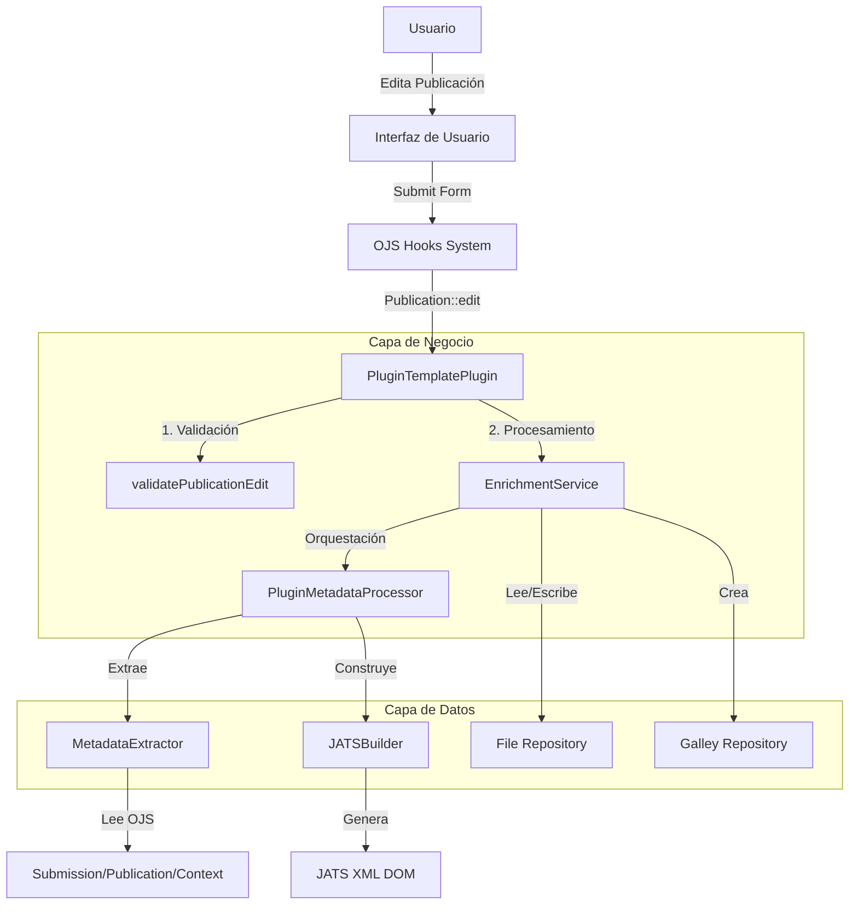
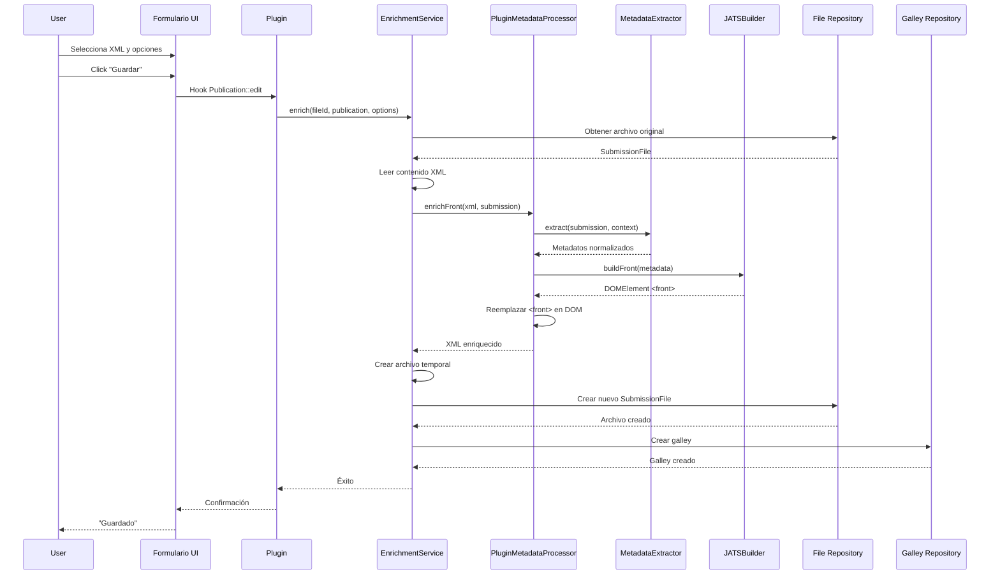

# XML Enricher Plugin para OJS 3.4

[](https://pkp.sfu.ca/ojs/)
[](https://www.php.net/)
[](LICENSE)
[](https://jats.nlm.nih.gov/publishing/1.4/)

Plugin genérico para Open Journal Systems (OJS) que **enriquece automáticamente archivos XML JATS** con metadatos completos extraídos del sistema OJS, generando archivos conformes al estándar JATS Publishing DTD 1.4.

---

## 🎯 Características Principales

- ✅ **Enriquecimiento automático de XML JATS** con metadatos de OJS
- ✅ **Conformidad JATS Publishing DTD 1.4**
- ✅ **Integración completa** con el workflow de publicación de OJS
- ✅ **Preview del front XML** antes de generar
- ✅ **Creación automática de galleys** para publicación
- ✅ **Sufijos personalizables** para archivos generados
- ✅ **Modo sobrescritura** para actualizar archivos existentes
- ✅ **Extracción completa de metadatos**: revista, artículo, autores, fechas, licencias

---

## 📋 Tabla de Contenidos

- [Requisitos](#-requisitos)
- [Instalación](#-instalación)
- [Uso](#-uso)
- [Arquitectura](#-arquitectura)
- [Componentes](#-componentes)
- [Flujo de Trabajo](#-flujo-de-trabajo)
- [Ejemplo de Salida](#-ejemplo-de-salida)
- [Documentación Completa](#-documentación-completa)
- [Desarrollo](#-desarrollo)
- [Contribuir](#-contribuir)
- [Licencia](#-licencia)

---

## 🔧 Requisitos

- **OJS**: 3.4 o superior
- **PHP**: 7.3 o superior
- **Extensiones PHP**:
  - `ext-dom` - Manipulación de XML/DOM
  - `ext-json` - Encoding/decoding JSON
- **Archivos XML JATS** en production ready

---

## 📦 Instalación

### Método 1: Desde el repositorio

```bash
cd /path/to/ojs/plugins/generic
git clone https://github.com/tu-repo/pluginTemplate.git
cd pluginTemplate
```

### Método 2: Descarga manual

1. Descarga el plugin desde [releases](https://github.com/tu-repo/pluginTemplate/releases)
2. Extrae en `plugins/generic/pluginTemplate`
3. Asegúrate que los permisos sean correctos:

```bash
chown -R www-data:www-data pluginTemplate
chmod -R 755 pluginTemplate
```

### Activación

1. Ingresa al panel de administración de OJS
2. Ve a **Settings → Website → Plugins**
3. Busca "XML Enricher" en la lista de plugins genéricos
4. Haz click en **Enable** ✓

---

## 🚀 Uso

### Paso 1: Subir archivo XML JATS

1. Ve al **Workflow** de un artículo
2. En la fase **Production**, sube tu archivo XML JATS
3. Asegúrate que esté marcado como **Production Ready**

### Paso 2: Enriquecer el XML

1. Ve a la pestaña **Publication** dentro del workflow
2. Abre el tab **XML Enricher**
3. Configura las opciones:
   - **Seleccionar archivo XML**: Elige el archivo a enriquecer
   - **Sufijo** (opcional): Personaliza el sufijo (default: `-enriched`)
   - **Sobrescribir** (opcional): Marca si deseas reemplazar archivos existentes
4. **(Opcional)** Click en **Mostrar Front** para preview del XML enriquecido
5. Click en **Guardar**

### Paso 3: Verificar resultado

El plugin automáticamente:
- ✅ Crea un nuevo archivo XML con sufijo (ej: `article-enriched.xml`)
- ✅ Genera un galley publicable (etiqueta: "XML")
- ✅ El archivo queda disponible en la publicación

---

## 🏗️ Arquitectura

El plugin sigue una **arquitectura modular de capas** que separa responsabilidades:



### Capas del Sistema

| Capa | Componentes | Responsabilidad |
|------|-------------|-----------------|
| **Integración** | `PluginTemplatePlugin` | Hooks de OJS, configuración |
| **Servicios** | `EnrichmentService` | Lógica de negocio, orquestación |
| **Procesamiento** | `PluginMetadataProcessor`<br>`MetadataExtractor`<br>`JATSBuilder` | Transformación XML, extracción de datos |
| **Presentación** | `EnrichmentForm`<br>`enricherForm.tpl`<br>`enricherForm.js` | Interfaz de usuario, formularios |

---

## 🔩 Componentes

### Backend

#### 1. PluginTemplatePlugin.php
**Punto de entrada del plugin**. Registra hooks de OJS y coordina el flujo.

**Hooks utilizados**:
- `Template::Workflow::Publication` - Inyecta UI
- `Schema::get::publication` - Extiende schema
- `Publication::validate` - Valida formulario
- `Publication::edit` - Procesa enriquecimiento
- `SubmissionFile::delete::before` - Limpieza de galleys
- `LoadHandler` - Endpoint AJAX para preview

#### 2. MetadataExtractor.php
**Extrae metadatos de objetos OJS**. Convierte estructuras complejas de OJS en arrays normalizados.

**Datos extraídos**:
```php
[
    'journal'     => [title, issn, publisher, ...],
    'article'     => [title, doi, abstract, keywords, pages, ...],
    'authors'     => [[given, family, orcid, affiliation, ...], ...],
    'sections'    => [title, abbrev],
    'pubDates'    => [published, submitted, accepted],
    'permissions' => [copyrightHolder, copyrightYear, licenseUrl, ...]
]
```

#### 3. JATSBuilder.php
**Construye nodos DOM JATS**. Genera XML conforme al estándar JATS Publishing DTD 1.4.

**Métodos principales**:
- `buildFront()` - Construye nodo `<front>` completo
- `buildJournalMeta()` - Metadatos de revista
- `buildArticleMeta()` - Metadatos de artículo
- `buildContribGroup()` - Grupo de autores
- `buildPermissions()` - Licencias y copyright

#### 4. PluginMetadataProcessor.php
**Orquestador de transformación**. Coordina extracción y construcción.

**Flujo**:
```
XML String → DOM → MetadataExtractor → JATSBuilder → DOM Manipulation → XML String
```

#### 5. EnrichmentService.php
**Servicio centralizado**. Maneja archivos, galleys, y orquesta el proceso completo.

**Métodos clave**:
- `getProductionXmlFiles()` - Lista archivos XML disponibles
- `enrich()` - Orquesta enriquecimiento
- `createEnrichedFile()` - Crea archivo en repositorio
- `createGalley()` - Genera galley publicable
- `deleteGalleys()` - Limpieza de dependencias
- `extractFrontElement()` - Preview del front

### Frontend

#### 6. EnrichmentForm.php
**Componente de formulario Vue**. Define estructura del formulario usando FormComponent de OJS.

#### 7. enricherForm.tpl
**Template Smarty**. Renderiza el tab del plugin con Vue component.

#### 8. enricherForm.js
**Módulo JavaScript**. Maneja lógica de UI, manipulación DOM, y preview AJAX.

**Funciones**:
- `injectVueConfig()` - Inyecta configuración en Vue state
- `convertSuffixToFieldset()` - Ajustes de estilo
- `setupShowFrontButton()` - Configura preview del front

---

## 🔄 Flujo de Trabajo



### Proceso Detallado

1. **Usuario selecciona archivo** en el formulario del tab "XML Enricher"
2. **Validación**: Hook `Publication::validate` verifica que se seleccionó un archivo
3. **Lectura**: `EnrichmentService` lee el contenido del XML original
4. **Extracción**: `MetadataExtractor` obtiene todos los metadatos de OJS
5. **Construcción**: `JATSBuilder` genera el nodo `<front>` JATS completo
6. **Procesamiento**: `PluginMetadataProcessor` reemplaza el `<front>` en el DOM
7. **Creación**: Se crea un nuevo archivo con sufijo personalizado
8. **Galley**: Se genera automáticamente un galley para publicación
9. **Resultado**: Archivo enriquecido disponible en la publicación

---

## 📝 Ejemplo de Salida

### XML Original (entrada)
```xml
<?xml version="1.0" encoding="UTF-8"?>
<article>
    <front>
        <article-title>Título básico</article-title>
    </front>
    <body>
        <p>Contenido del artículo...</p>
    </body>
</article>
```

### XML Enriquecido (salida)
```xml
<?xml version="1.0" encoding="UTF-8"?>
<article>
    <front>
        <journal-meta>
            <journal-title-group>
                <journal-title>Revista de Investigación</journal-title>
            </journal-title-group>
            <issn pub-type="epub">2618-2920</issn>
            <publisher>
                <publisher-name>Universidad Nacional de La Plata</publisher-name>
            </publisher>
        </journal-meta>
        <article-meta>
            <article-id pub-id-type="doi">10.24215/ejemplo</article-id>
            <title-group>
                <article-title>Análisis del Plugin XML Enricher</article-title>
            </title-group>
            <contrib-group>
                <contrib contrib-type="author">
                    <name>
                        <surname>García</surname>
                        <given-names>Juan</given-names>
                    </name>
                    <email>juan@example.com</email>
                    <contrib-id contrib-id-type="orcid">0000-0001-2345-6789</contrib-id>
                    <aff>
                        <institution>SEDICI - UNLP</institution>
                    </aff>
                </contrib>
            </contrib-group>
            <pub-date pub-type="epub">
                <year>2025</year>
                <month>12</month>
                <day>04</day>
            </pub-date>
            <volume>10</volume>
            <issue>2</issue>
            <fpage>123</fpage>
            <lpage>145</lpage>
            <permissions>
                <license license-type="open-access" 
                         xlink:href="http://creativecommons.org/licenses/by/4.0/">
                    <license-p>Acceso abierto bajo CC BY 4.0</license-p>
                </license>
            </permissions>
            <abstract>
                <p>Este artículo presenta un análisis técnico...</p>
            </abstract>
            <kwd-group>
                <kwd>OJS</kwd>
                <kwd>JATS</kwd>
                <kwd>XML</kwd>
            </kwd-group>
            <custom-meta-group>
                <custom-meta>
                    <meta-name>section-title</meta-name>
                    <meta-value>Artículos</meta-value>
                </custom-meta>
            </custom-meta-group>
        </article-meta>
    </front>
    <body>
        <p>Contenido del artículo...</p>
    </body>
</article>
```

---

## 📚 Documentación Completa

La documentación exhaustiva del plugin está organizada en tickets de Redmine:

### Documentación Técnica

| Ticket | Tema | Archivo |
|--------|------|---------|
| **#1** | [Arquitectura General](docs/redmine-tickets/ticket_1_arquitectura_general.md) | Estructura modular, componentes, hooks |
| **#2** | [Sistema de Enriquecimiento](docs/redmine-tickets/ticket_2_sistema_enriquecimiento.md) | MetadataExtractor, JATSBuilder, DTD 1.4 |
| **#3** | [Interfaz de Usuario](docs/redmine-tickets/ticket_3_interfaz_usuario.md) | Vue, Smarty, JavaScript, preview |
| **#4** | [Gestión de Archivos](docs/redmine-tickets/ticket_4_gestion_archivos.md) | FileRepo, Galleys, SubmissionFiles |
| **#5** | [Mejoras Propuestas](docs/redmine-tickets/ticket_5_mejoras_propuestas.md) | Refactorización, roadmap, mejoras |

📖 **[Índice Completo](docs/redmine-tickets/README_tickets.md)**

---

## 🛠️ Desarrollo

### Estructura de Directorios

```
pluginTemplate/
├── PluginTemplatePlugin.php         # Clase principal
├── PluginTemplateSettingsForm.php   # Settings del plugin
├── index.php                         # Entry point
├── version.xml                       # Versión
├── LICENSE                           # GPL v3
├── README.md                         # Este archivo
├── classes/
│   ├── JATSBuilder.php              # Constructor JATS XML
│   ├── MetadataExtractor.php        # Extractor metadatos
│   ├── PluginMetadataProcessor.php  # Orquestador
│   ├── components/
│   │   └── EnrichmentForm.php       # Componente Vue
│   └── services/
│       └── EnrichmentService.php    # Servicio principal
├── templates/
│   ├── enricherForm.tpl             # Template formulario
│   └── js/
│       └── enricherForm.js          # Lógica JavaScript
├── locale/
│   └── es/
│       └── locale.po                # Traducciones español
├── docs/
│   └── redmine-tickets/             # Documentación técnica
└── tests/                            # Tests (futuro)
```

### Extender el Plugin

#### Añadir nuevos campos JATS

1. **Extrae el dato en `MetadataExtractor`**:
```php
protected function extractArticle($submission) {
    return [
        // ... campos existentes
        'customField' => $submission->getData('customField')
    ];
}
```

2. **Construye el nodo en `JATSBuilder`**:
```php
private function buildArticleMeta($metadata) {
    // ... código existente
    
    if (!empty($metadata['customField'])) {
        $customNode = $this->el('custom-element', $metadata['customField']);
        $articleMeta->appendChild($customNode);
    }
}
```

#### Crear un nuevo tipo de preview

1. **Añade método en `EnrichmentService`**:
```php
public static function extractCustomElement($fileId) {
    // Lógica similar a extractFrontElement
}
```

2. **Añade endpoint en `PluginTemplatePlugin`**:
```php
public function handleCustomRequest() {
    $fileId = $request->getUserVar('fileId');
    $result = EnrichmentService::extractCustomElement($fileId);
    return new JSONMessage(true, ['data' => $result]);
}
```

3. **Llama desde JavaScript**:
```javascript
fetch('/index.php/.../show-custom', {
    method: 'POST',
    body: 'fileId=' + fileId
})
.then(response => response.json())
.then(data => console.log(data));
```

### Testing

#### Tests Unitarios (futuro)

```bash
# Instalar dependencias
composer install --dev

# Ejecutar tests
./vendor/bin/phpunit tests/
```

#### Tests de Integración

1. Sube un XML de prueba a un submission
2. Configura el plugin con sufijo `-test`
3. Guarda y verifica que se crea `article-test.xml`
4. Verifica que se generó el galley "XML test"

### Debugging

Activa logs en `config.inc.php`:

```ini
[debug]
show_stacktrace = On
display_errors = On
deprecation_warnings = On
```

Los logs del plugin aparecen con prefijo `[PluginTemplate]`, `[EnrichmentService]`, etc.

---

## 🤝 Contribuir

¡Las contribuciones son bienvenidas! Por favor sigue estos pasos:

1. **Fork** el repositorio
2. **Crea una rama** para tu feature (`git checkout -b feature/AmazingFeature`)
3. **Commit** tus cambios (`git commit -m 'Add some AmazingFeature'`)
4. **Push** a la rama (`git push origin feature/AmazingFeature`)
5. **Abre un Pull Request**

### Guías de Contribución

- Sigue [PSR-12](https://www.php-fig.org/psr/psr-12/) para código PHP
- Documenta con PHPDoc
- Añade tests para nuevas funcionalidades
- Actualiza la documentación si es necesario

---

## 📄 Licencia

Este proyecto está licenciado bajo **GNU General Public License v3.0** - ver el archivo [LICENSE](LICENSE) para detalles.

```
Copyright (c) 2017-2023 Simon Fraser University
Copyright (c) 2017-2023 John Willinsky
Distributed under the GNU GPL v3.
```

---

## 🔗 Referencias

- [JATS Publishing DTD 1.4](https://jats.nlm.nih.gov/publishing/1.4/)
- [OJS Documentation](https://docs.pkp.sfu.ca/dev/)
- [OJS Plugin Development Guide](https://docs.pkp.sfu.ca/dev/plugin-guide/)
- [JATS4R - JATS for Reuse](https://jats4r.org/)

---

## 📧 Soporte

- **Issues**: [GitHub Issues](https://github.com/tu-repo/pluginTemplate/issues)
- **Documentación**: Ver carpeta `docs/redmine-tickets/`
- **OJS Forum**: [PKP Community Forum](https://forum.pkp.sfu.ca/)

---

## 🙏 Agradecimientos

- Equipo de PKP por OJS
- Comunidad JATS por el estándar
- SEDICI - UNLP

---

<p align="center">
  Hecho con ❤️ para la comunidad de acceso abierto
</p>
