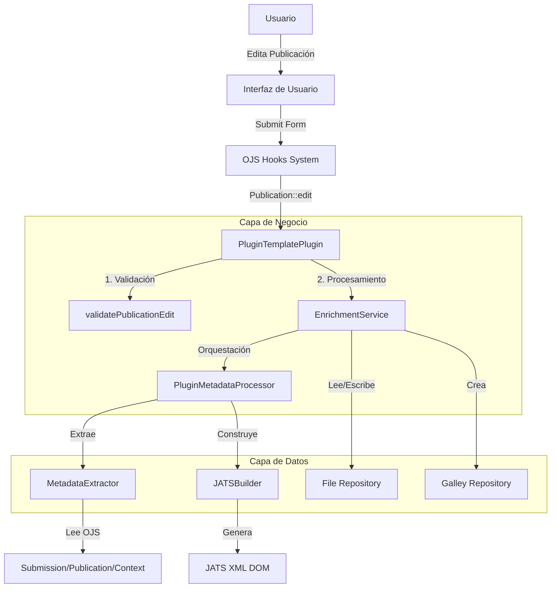

# Ticket 1: Arquitectura General del Plugin XML Enricher

## Descripción

El **Plugin XML Enricher** (nombre interno: `pluginTemplate`) es un plugin genérico para OJS 3.4 que permite enriquecer archivos XML JATS con metadatos extraídos del sistema OJS. El plugin intercepta el flujo de publicación de artículos para procesar archivos XML seleccionados y generar versiones enriquecidas con información completa de metadatos.

## Propósito

- Automatizar el enriquecimiento de archivos XML JATS con metadatos OJS
- Mantener consistencia entre los metadatos almacenados en OJS y los archivos XML de publicación
- Generar archivos XML conforme al estándar JATS Publishing DTD 1.4
- Facilitar la creación de galleys con XML enriquecido

## Arquitectura Modular

El plugin sigue una arquitectura de capas que separa responsabilidades:



## Componentes Principales

### 1. Capa de Integración

#### [`PluginTemplatePlugin.php`](file:///home/santi/sedici/ojs-docker/data/public_ojs/plugins/generic/pluginTemplate/PluginTemplatePlugin.php)
- **Tipo**: Clase principal del plugin
- **Responsabilidad**: Punto de entrada, registro de hooks OJS
- **Hooks utilizados**:
  - `Template::Workflow::Publication` - Inyecta UI en workflow
  - `Schema::get::publication` - Extiende esquema de publicación
  - `Publication::validate` - Valida formulario
  - `Publication::edit` - Procesa enriquecimiento
  - `SubmissionFile::delete::before` - Limpieza de galleys
  - `LoadHandler` - Maneja peticiones AJAX

### 2. Capa de Servicios

#### [`EnrichmentService.php`](file:///home/santi/sedici/ojs-docker/data/public_ojs/plugins/generic/pluginTemplate/classes/services/EnrichmentService.php)
- **Tipo**: Servicio centralizado
- **Responsabilidad**: Lógica de negocio de enriquecimiento
- **Funciones clave**:
  - `getProductionXmlFiles()` - Lista archivos XML disponibles
  - `enrich()` - Orquesta proceso de enriquecimiento
  - `enrichSingleFile()` - Procesa un archivo individual
  - `createEnrichedFile()` - Crea nuevo archivo en repositorio
  - `createGalley()` - Genera galley para publicación
  - `deleteGalleys()` - Limpieza de galleys asociados
  - `extractFrontElement()` - Extrae elemento `<front>` para preview

### 3. Capa de Procesamiento de Datos

#### [`PluginMetadataProcessor.php`](file:///home/santi/sedici/ojs-docker/data/public_ojs/plugins/generic/pluginTemplate/classes/PluginMetadataProcessor.php)
- **Tipo**: Orquestador de transformación XML
- **Responsabilidad**: Coordina extracción y construcción
- **Flujo**: XML String → DOM → MetadataExtractor → JATSBuilder → XML String

#### [`MetadataExtractor.php`](file:///home/santi/sedici/ojs-docker/data/public_ojs/plugins/generic/pluginTemplate/classes/MetadataExtractor.php)
- **Tipo**: Extractor de metadatos
- **Responsabilidad**: Convertir objetos OJS en arrays normalizados
- **Datos extraídos**:
  - Información de la revista (título, ISSN, editorial)
  - Metadatos del artículo (título, resumen, DOI, páginas)
  - Autores y afiliaciones
  - Secciones y categorías
  - Fechas de publicación
  - Información de copyright y licencias

#### [`JATSBuilder.php`](file:///home/santi/sedici/ojs-docker/data/public_ojs/plugins/generic/pluginTemplate/classes/JATSBuilder.php)
- **Tipo**: Constructor de XML JATS
- **Responsabilidad**: Generar nodos DOM JATS válidos
- **Secciones construidas**:
  - `<journal-meta>` - Metadatos de la revista
  - `<article-meta>` - Metadatos del artículo
  - `<contrib-group>` - Grupo de autores
  - `<pub-date>` - Fechas de publicación
  - `<permissions>` - Información de licencias
  - `<custom-meta-group>` - Metadatos personalizados

### 4. Capa de Presentación

#### [`EnrichmentForm.php`](file:///home/santi/sedici/ojs-docker/data/public_ojs/plugins/generic/pluginTemplate/classes/components/EnrichmentForm.php)
- **Tipo**: Componente de formulario Vue
- **Responsabilidad**: Definición del formulario UI

#### [`enricherForm.tpl`](file:///home/santi/sedici/ojs-docker/data/public_ojs/plugins/generic/pluginTemplate/templates/enricherForm.tpl)
- **Tipo**: Template Smarty
- **Responsabilidad**: Renderizado del formulario
- **Características**:
  - Integración con sistema de componentes Vue de OJS
  - Selector de archivos XML (solo archivos production-ready)
  - Campo de sufijo personalizado (default: `-enriched`)
  - Checkbox de sobrescritura
  - Botón "Mostrar Front" para preview

#### [`enricherForm.js`](file:///home/santi/sedici/ojs-docker/data/public_ojs/plugins/generic/pluginTemplate/templates/js/enricherForm.js)
- **Tipo**: Módulo JavaScript
- **Responsabilidad**: Lógica de interfaz y manipulación DOM
- **Funciones**:
  - Inyección de configuración Vue
  - Conversión de campo sufijo a fieldset
  - Vinculación de checkbox overwrite
  - Configuración del botón preview

## Estructura de Directorios

```
pluginTemplate/
├── PluginTemplatePlugin.php         # Clase principal
├── PluginTemplateSettingsForm.php   # Configuración del plugin
├── index.php                         # Entry point
├── version.xml                       # Versión del plugin
├── classes/
│   ├── JATSBuilder.php              # Constructor JATS XML
│   ├── MetadataExtractor.php        # Extractor de metadatos
│   ├── PluginMetadataProcessor.php  # Orquestador
│   ├── components/
│   │   └── EnrichmentForm.php       # Componente formulario
│   └── services/
│       └── EnrichmentService.php    # Servicio principal
├── templates/
│   ├── enricherForm.tpl             # Template del formulario
│   └── js/
│       └── enricherForm.js          # Lógica JavaScript
└── locale/
    └── es/
        └── locale.po                # Traducciones español
```

## Flujo de Trabajo

1. **Usuario accede al tab "XML Enricher"** en el workflow de publicación
2. **El plugin inyecta el formulario** mediante hook `Template::Workflow::Publication`
3. **Usuario selecciona**:
   - Archivo XML a enriquecer
   - Sufijo para el archivo resultante (opcional)
   - Si desea sobrescribir archivos existentes
4. **Al guardar**, hook `Publication::validate` valida la selección
5. **Hook `Publication::edit`** dispara el enriquecimiento:
   - `EnrichmentService::enrich()` coordina el proceso
   - `PluginMetadataProcessor::enrichFront()` enriquece el XML
   - Se crea un nuevo archivo con sufijo
   - Se genera un galley asociado
6. **El archivo enriquecido** queda disponible en la publicación

## Integración con OJS

### Hooks Utilizados

| Hook | Propósito | Método |
|------|-----------|--------|
| `Template::Workflow::Publication` | Inyectar tab en UI | `addToPublicationForms()` |
| `Schema::get::publication` | Extender esquema | `addToSchema()` |
| `Publication::validate` | Validar formulario | `validatePublicationEdit()` |
| `Publication::edit` | Procesar enriquecimiento | `handlePublicationEdit()` |
| `SubmissionFile::delete::before` | Limpiar galleys | `handleFileDelete()` |
| `LoadHandler` | Endpoint AJAX preview | `setupHandler()` |

### Campos Personalizados en Schema

```php
'pluginTemplate::xmlFileId' => [
    'type' => 'integer',
    'validation' => ['nullable']
],
'pluginTemplate::suffix' => [
    'type' => 'string',
    'validation' => ['nullable']
],
'pluginTemplate::overwrite' => [
    'type' => 'boolean',
    'validation' => ['nullable']
]
```

## Dependencias

- **OJS**: 3.4+
- **PHP**: 7.3+ (con extensión DOM)
- **Extensiones PHP requeridas**:
  - `ext-dom` - Manipulación de XML/DOM
  - `ext-json` - Encoding/decoding JSON

## Versión Actual

- **Release**: 1.0.0.0
- **Fecha**: 2023-05-15
- **Tipo**: Plugin genérico

## Referencias

- [JATS Publishing DTD 1.4](https://jats.nlm.nih.gov/publishing/1.4/)
- [OJS Plugin Development Guide](https://docs.pkp.sfu.ca/dev/plugin-guide/)
- [CODE_REVIEW.md](file:///home/santi/sedici/ojs-docker/data/public_ojs/plugins/generic/pluginTemplate/CODE_REVIEW.md) - Análisis técnico detallado
