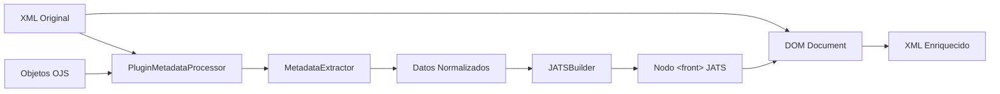
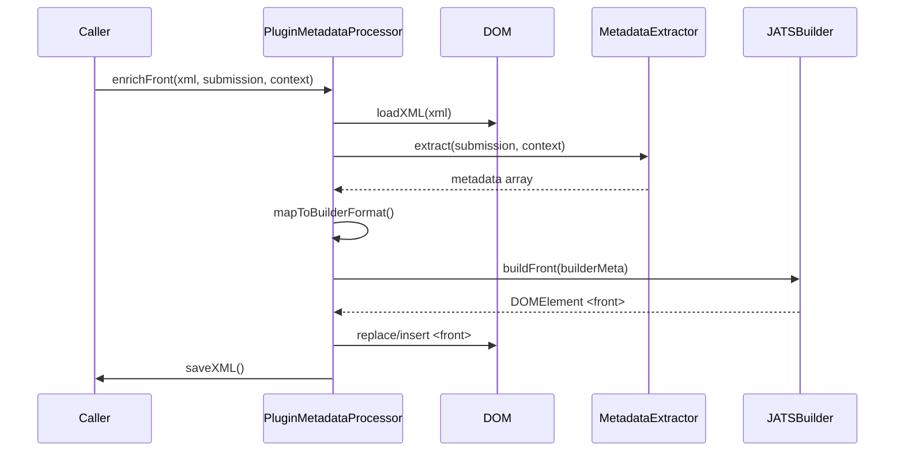
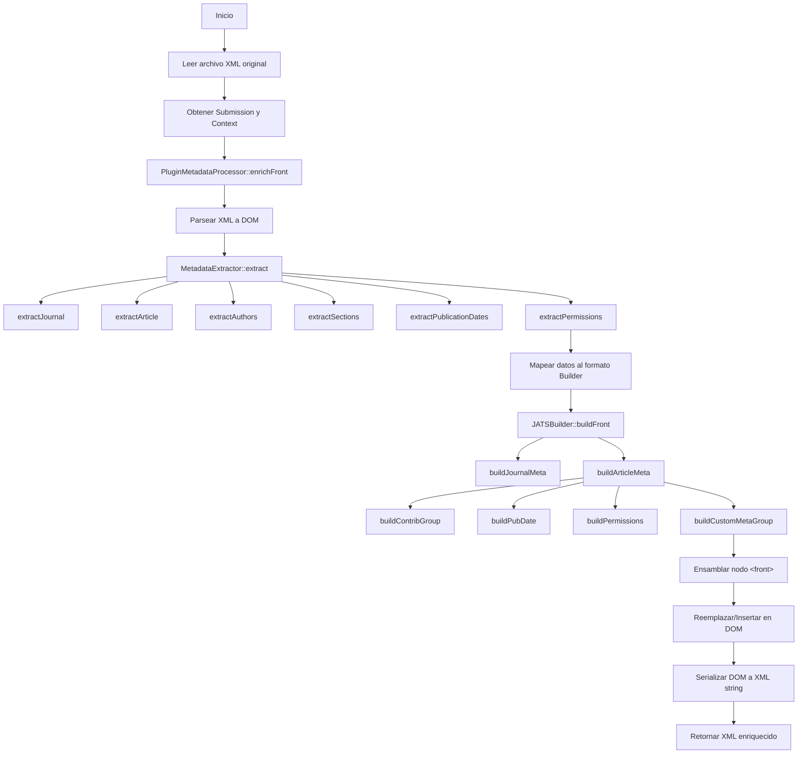

# Ticket 2: Sistema de Enriquecimiento XML y Procesamiento de Metadatos

## Descripción

Este ticket documenta el núcleo funcional del plugin: el sistema de enriquecimiento XML que extrae metadatos de OJS y construye secciones JATS XML conformes al estándar JATS Publishing DTD 1.4.

## Objetivo del Sistema

Transformar archivos XML JATS base en archivos enriquecidos que contengan la totalidad de metadatos disponibles en OJS, específicamente en la sección `<front>` del documento JATS.

## Arquitectura del Sistema de Enriquecimiento



## Componentes del Sistema

### 1. MetadataExtractor - Extracción de Metadatos

**Archivo**: [`MetadataExtractor.php`](file:///home/santi/sedici/ojs-docker/data/public_ojs/plugins/generic/pluginTemplate/classes/MetadataExtractor.php)

#### Propósito
Desacoplar la estructura interna de OJS de la estructura del XML JATS. Convierte objetos complejos de OJS en arrays planos normalizados.

#### Método Principal

```php
public function extract(PKPSubmission $submission, Context $context): array
```

#### Datos Extraídos

##### A. Metadatos de la Revista (`extractJournal`)
```php
[
    'title'     => string,  // Nombre de la revista
    'abbrev'    => string,  // Acrónimo
    'publisher' => string,  // Institución publicadora
    'issn'      => string,  // ISSN (online o print)
    'url'       => string   // URL path
]
```

##### B. Metadatos del Artículo (`extractArticle`)
```php
[
    'title'        => string,  // Título localizado
    'subtitle'     => string,  // Subtítulo
    'doi'          => string,  // DOI del artículo
    'abstract'     => string,  // Resumen
    'keywords'     => array,   // Palabras clave
    'pages'        => string,  // Ej: "123-145"
    'firstPage'    => string,  // Página inicial
    'lastPage'     => string,  // Página final
    'volume'       => string,  // Volumen
    'issue'        => string,  // Número
    'issueYear'    => string,  // Año del número
    'languages'    => string,  // Locale
    'issueId'      => int,     // ID del issue
    'submissionId' => int      // ID del submission
]
```

**Nota sobre páginas**: El extractor usa regex para parsear el campo `pages`:
- `"123-145"` → `firstPage: "123"`, `lastPage: "145"`
- `"123"` → `firstPage: "123"`, `lastPage: "123"`

##### C. Autores (`extractAuthors`)
```php
[
    [
        'given'       => string,  // Nombre
        'family'      => string,  // Apellido
        'email'       => string,  // Email
        'orcid'       => string,  // ORCID ID
        'affiliation' => string,  // Afiliación institucional
        'country'     => string,  // País
        'sequence'    => int,     // Orden
        'isPrimary'   => bool     // Autor de contacto
    ],
    // ... más autores
]
```

##### D. Secciones (`extractSections`)
```php
[
    'title'  => string,  // Ej: "Artículos", "Reseñas"
    'abbrev' => string   // Abreviatura de la sección
]
```

##### E. Fechas de Publicación (`extractPublicationDates`)
```php
[
    'published' => string,  // Fecha de publicación
    'submitted' => string,  // Fecha de envío
    'accepted'  => string   // Fecha de aceptación
]
```

##### F. Permisos y Licencias (`extractPermissions`)
```php
[
    'copyrightHolder' => string,  // Titular del copyright
    'copyrightYear'   => string,  // Año
    'licenseUrl'      => string,  // URL de la licencia
    'rights'          => string   // Texto de derechos
]
```

#### Ventajas del Diseño
- **Desacoplamiento**: Si OJS cambia su estructura interna, solo se modifica esta clase
- **Testeable**: Función pura (Objects → Array), fácil de testear unitariamente
- **Reutilizable**: Puede usarse para otros propósitos (exportación, reportes)

---

### 2. JATSBuilder - Construcción de XML JATS

**Archivo**: [`JATSBuilder.php`](file:///home/santi/sedici/ojs-docker/data/public_ojs/plugins/generic/pluginTemplate/classes/JATSBuilder.php)

#### Propósito
Construir nodos DOM JATS válidos a partir de arrays de datos. Encapsula la complejidad de la estructura JATS (nodos anidados, atributos, namespaces).

#### Estructura del Constructor

```php
class JATSBuilder
{
    private DOMDocument $dom;
    
    public function __construct();
    public function getDocument(): DOMDocument;
    
    // Helpers
    private function el(string $name, ?string $text = null): DOMElement;
    private function elAttr(string $name, array $attrs, ?string $text = null): DOMElement;
    
    // Builders
    public function buildFront(array $metadata): DOMElement;
    private function buildJournalMeta(array $journal): DOMElement;
    private function buildArticleMeta(array $metadata): DOMElement;
    private function buildContribGroup(array $authors): DOMElement;
    private function buildPubDate(string $type, string $dateYmd): DOMElement;
    private function buildPermissions(array $license): DOMElement;
    private function buildCustomMetaGroup(array $items): DOMElement;
}
```

#### Métodos de Construcción

##### `buildFront(array $metadata): DOMElement`
Método principal que construye el nodo `<front>` completo.

**Estructura generada**:
```xml
<front>
    <journal-meta>...</journal-meta>
    <article-meta>...</article-meta>
</front>
```

##### `buildJournalMeta(array $journal): DOMElement`
Construye metadatos de la revista.

**Salida**:
```xml
<journal-meta>
    <journal-title-group>
        <journal-title>Nombre de la Revista</journal-title>
    </journal-title-group>
    <issn pub-type="epub">1234-5678</issn>
    <publisher>
        <publisher-name>Institución</publisher-name>
    </publisher>
</journal-meta>
```

##### `buildArticleMeta(array $metadata): DOMElement`
Construye metadatos del artículo. Este es el método más complejo.

**Salida**:
```xml
<article-meta>
    <article-id pub-id-type="doi">10.1234/example</article-id>
    <title-group>
        <article-title>Título del Artículo</article-title>
    </title-group>
    <contrib-group>...</contrib-group>
    <pub-date pub-type="epub">
        <year>2023</year>
        <month>05</month>
        <day>15</day>
    </pub-date>
    <volume>10</volume>
    <issue>2</issue>
    <fpage>123</fpage>
    <lpage>145</lpage>
    <permissions>...</permissions>
    <abstract>
        <p>Texto del resumen...</p>
    </abstract>
    <kwd-group>
        <kwd>palabra clave 1</kwd>
        <kwd>palabra clave 2</kwd>
    </kwd-group>
    <custom-meta-group>...</custom-meta-group>
</article-meta>
```

##### `buildContribGroup(array $authors): DOMElement`
Construye el grupo de autores/contribuyentes.

**Salida**:
```xml
<contrib-group>
    <contrib contrib-type="author">
        <name>
            <surname>García</surname>
            <given-names>Juan</given-names>
        </name>
        <email>juan.garcia@example.com</email>
        <contrib-id contrib-id-type="orcid">0000-0001-2345-6789</contrib-id>
        <aff>
            <institution>Universidad Nacional</institution>
        </aff>
    </contrib>
    <!-- Más autores -->
</contrib-group>
```

##### `buildPubDate(string $type, string $dateYmd): DOMElement`
Construye nodos de fecha.

**Entrada**: `"2023-05-15"`, `"epub"`

**Salida**:
```xml
<pub-date pub-type="epub">
    <year>2023</year>
    <month>05</month>
    <day>15</day>
</pub-date>
```

##### `buildPermissions(array $license): DOMElement`
Construye información de licencia y copyright.

**Salida**:
```xml
<permissions>
    <copyright-statement>© 2023 Juan García</copyright-statement>
    <copyright-year>2023</copyright-year>
    <copyright-holder>Juan García</copyright-holder>
    <license license-type="open-access" xlink:href="http://creativecommons.org/licenses/by/4.0/">
        <license-p>Este es un artículo de acceso abierto...</license-p>
    </license>
</permissions>
```

##### `buildCustomMetaGroup(array $items): DOMElement`
Construye metadatos personalizados no estándar en JATS.

**Uso**: Para almacenar información específica de OJS (ej: sección, categorías especiales).

**Salida**:
```xml
<custom-meta-group>
    <custom-meta>
        <meta-name>section-title</meta-name>
        <meta-value>Artículos</meta-value>
    </custom-meta>
    <custom-meta>
        <meta-name>section-abbrev</meta-name>
        <meta-value>ART</meta-value>
    </custom-meta>
</custom-meta-group>
```

#### Helpers de Creación de Nodos

```php
// Crear elemento simple
private function el(string $name, ?string $text = null): DOMElement

// Crear elemento con atributos
private function elAttr(string $name, array $attrs, ?string $text = null): DOMElement
```

**Ejemplo de uso interno**:
```php
$this->elAttr('issn', ['pub-type' => 'epub'], '1234-5678');
// Genera: <issn pub-type="epub">1234-5678</issn>
```

---

### 3. PluginMetadataProcessor - Orquestador

**Archivo**: [`PluginMetadataProcessor.php`](file:///home/santi/sedici/ojs-docker/data/public_ojs/plugins/generic/pluginTemplate/classes/PluginMetadataProcessor.php)

#### Propósito
Coordinar la transformación completa: XML original → Extracción → Construcción → XML enriquecido.

#### Método Principal

```php
public static function enrichFront(
    $xmlOrDom, 
    $submission = null, 
    $publication = null, 
    $context = null
): string
```

#### Flujo de Procesamiento



#### Pasos Detallados

1. **Carga del XML**
   ```php
   $dom = new DOMDocument();
   $dom->loadXML($xmlOrDom);
   ```

2. **Extracción de metadatos**
   ```php
   $extractor = new MetadataExtractor();
   $meta = $extractor->extract($submission, $context);
   ```

3. **Mapeo al formato del Builder**
   Convierte el array del extractor al formato esperado por JATSBuilder:
   ```php
   $builderMeta = [
       'journal' => [...],
       'articleId' => $meta['article']['submissionId'],
       'doi' => $meta['article']['doi'],
       'title' => $meta['article']['title'],
       'authors' => array_map(...), // Transforma formato
       'license' => [...],
       'custom' => [...]
   ];
   ```

4. **Construcción del nodo `<front>`**
   ```php
   $builder = new JATSBuilder();
   $frontNode = $builder->buildFront($builderMeta);
   ```

5. **Reemplazo o inserción en DOM**
   - Si existe `<front>`: lo reemplaza
   - Si no existe: lo inserta en posición correcta (antes de `<body>` o `<back>`)

6. **Serialización**
   ```php
   return $dom->saveXML();
   ```

#### Manejo de Casos Especiales

##### Sin `<front>` existente
El procesador inserta el nuevo nodo siguiendo la estructura JATS:
- **Orden**: `<front>` → `<body>` → `<back>`
- **Lógica**:
  - Si existe `<body>`: insertar antes de body
  - Si no hay body pero hay `<back>`: insertar antes de back
  - Si no hay ninguno: insertar como primer hijo

##### Campos multilingües
```php
// Maneja tanto strings como arrays localizados
$title = is_array($meta['article']['title']) 
    ? reset($meta['article']['title']) 
    : $meta['article']['title'];
```

---

## Flujo Completo de Enriquecimiento



## Conformidad con JATS DTD 1.4

El plugin genera XML conforme a **JATS Publishing DTD version 1.4**.

### Elementos generados

| Elemento JATS | Fuente OJS | Builder Method |
|---------------|------------|----------------|
| `<journal-title>` | `Context::getLocalizedName()` | `buildJournalMeta` |
| `<issn>` | `Context::getData('onlineIssn')` | `buildJournalMeta` |
| `<publisher-name>` | `Context::getData('publisherInstitution')` | `buildJournalMeta` |
| `<article-id pub-id-type="doi">` | `Publication::getDoi()` | `buildArticleMeta` |
| `<article-title>` | `Publication::getLocalizedTitle()` | `buildArticleMeta` |
| `<contrib>` | `Publication::getData('authors')` | `buildContribGroup` |
| `<name>/<surname>` | `Author::getLocalizedFamilyName()` | `buildContribGroup` |
| `<contrib-id contrib-id-type="orcid">` | `Author::getOrcid()` | `buildContribGroup` |
| `<pub-date>` | `Publication::getData('datePublished')` | `buildPubDate` |
| `<volume>`, `<issue>` | `Issue::getVolume/Number()` | `buildArticleMeta` |
| `<fpage>`, `<lpage>` | `Publication::getData('pages')` (parseado) | `buildArticleMeta` |
| `<abstract>` | `Publication::getLocalizedData('abstract')` | `buildArticleMeta` |
| `<kwd>` | `Publication::getLocalizedData('keywords')` | `buildArticleMeta` |
| `<permissions>` | Datos de copyright/licencia | `buildPermissions` |
| `<custom-meta>` | Secciones y otros | `buildCustomMetaGroup` |

### Referencia DTD
- **URL**: https://jats.nlm.nih.gov/publishing/1.4/
- **Namespace**: No se declara namespace explícito (JATS 1.4 no lo requiere por defecto)

## Ejemplo de Salida

```xml
<?xml version="1.0" encoding="UTF-8"?>
<article>
    <front>
        <journal-meta>
            <journal-title-group>
                <journal-title>Revista de Investigación</journal-title>
            </journal-title-group>
            <issn pub-type="epub">2618-2920</issn>
            <publisher>
                <publisher-name>Universidad Nacional de La Plata</publisher-name>
            </publisher>
        </journal-meta>
        <article-meta>
            <article-id pub-id-type="doi">10.24215/ejemplo</article-id>
            <title-group>
                <article-title>Análisis del Plugin XML Enricher</article-title>
            </title-group>
            <contrib-group>
                <contrib contrib-type="author">
                    <name>
                        <surname>García</surname>
                        <given-names>Juan</given-names>
                    </name>
                    <email>juan@example.com</email>
                    <aff>
                        <institution>SEDICI - UNLP</institution>
                    </aff>
                </contrib>
            </contrib-group>
            <pub-date pub-type="epub">
                <year>2025</year>
                <month>12</month>
                <day>04</day>
            </pub-date>
            <volume>10</volume>
            <issue>2</issue>
            <permissions>
                <license license-type="open-access" 
                         xlink:href="http://creativecommons.org/licenses/by/4.0/">
                    <license-p>Acceso abierto bajo CC BY 4.0</license-p>
                </license>
            </permissions>
            <abstract>
                <p>Este artículo presenta un análisis técnico...</p>
            </abstract>
            <kwd-group>
                <kwd>OJS</kwd>
                <kwd>JATS</kwd>
                <kwd>XML</kwd>
            </kwd-group>
        </article-meta>
    </front>
    <body>
        <!-- Contenido original del body se preserva -->
    </body>
</article>
```

## Limitaciones Conocidas

1. **Fechas nulas**: Si `Publication::getData('datePublished')` es `null`, el método `buildPubDate` podría fallar. Actualmente hay validación para evitar esto.

2. **Multilingüismo**: El sistema toma el primer valor de arrays multilingües. No genera múltiples versiones del front por idioma.

3. **ORCID sin prefijo**: El plugin no valida ni normaliza ORCIDs, usa el valor tal como está almacenado en OJS.

4. **Parsing de páginas**: El regex de páginas solo soporta formatos `"123-145"` o `"123"`. Formatos especiales (ej: `"e12345"`) no se parsean correctamente.

Para activar logs en OJS: configurar nivel de log en `config.inc.php`.

## Referencias

- [JATS Publishing Tag Set](https://jats.nlm.nih.gov/publishing/)
- [JATS4R - JATS for Reuse](https://jats4r.org/) - Buenas prácticas
- [OJS Publication/Submission Objects](https://docs.pkp.sfu.ca/dev/documentation/en/architecture-entities)
