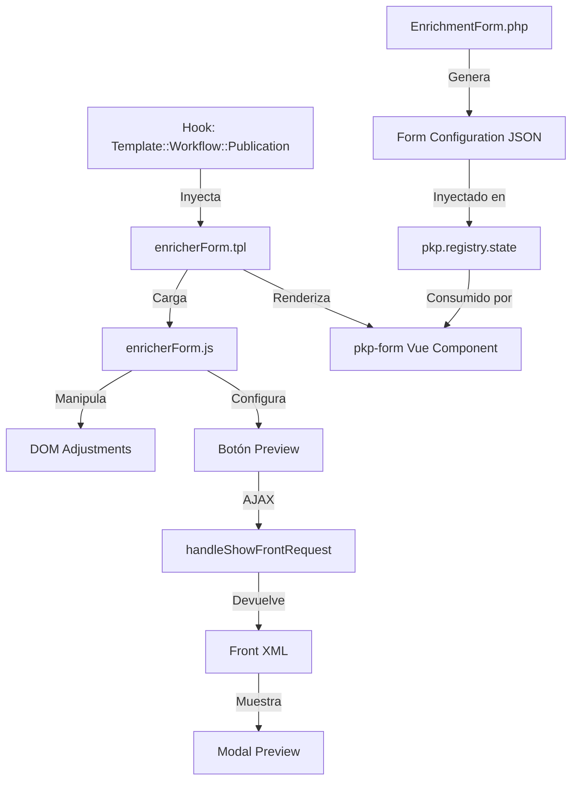
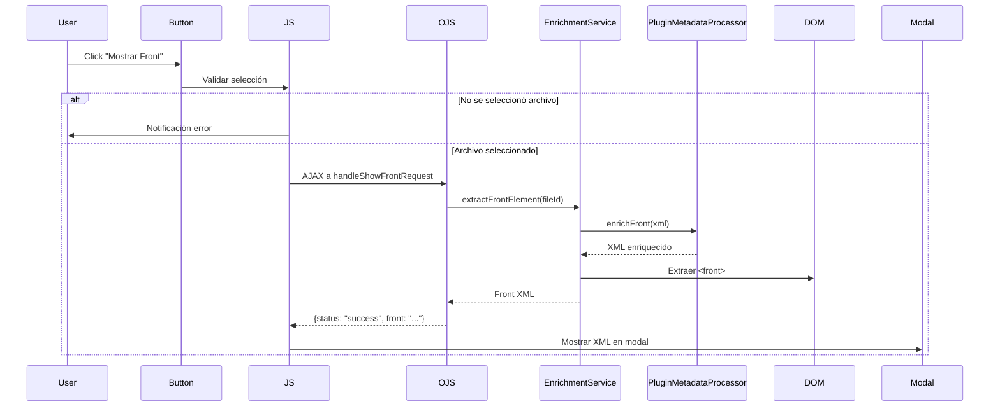
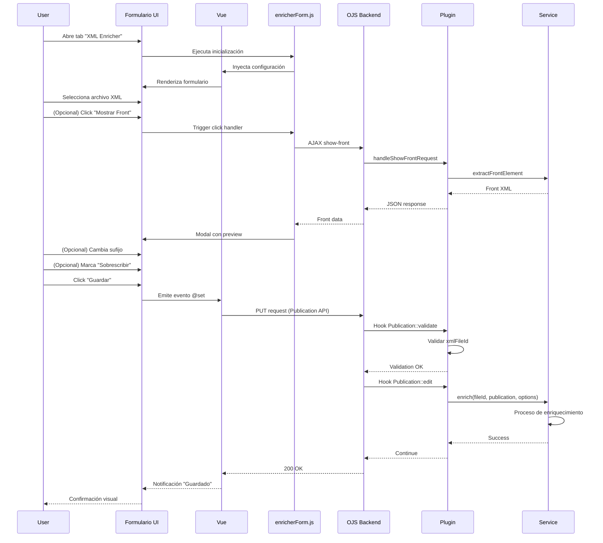

# Ticket 3: Interfaz de Usuario y Formularios

## Descripción

Este ticket documenta la capa de presentación del plugin: el formulario de enriquecimiento XML integrado en el workflow de publicación de OJS 3.4, incluyendo componentes Vue, templates Smarty, y módulos JavaScript.

## Ubicación en el Workflow

El formulario aparece como un **tab personalizado** llamado "XML Enricher" en la interfaz de edición de publicaciones:

```
Workflow → Production → Publication
    ├── Title & Abstract
    ├── Contributors
    ├── Metadata
    ├── Identifiers
    ├── Galleys
    └── XML Enricher ← TAB DEL PLUGIN
```

## Arquitectura de la UI



## Componentes de la UI

### 1. EnrichmentForm.php - Definición del Formulario

**Archivo**: [`EnrichmentForm.php`](file:///home/santi/sedici/ojs-docker/data/public_ojs/plugins/generic/pluginTemplate/classes/components/EnrichmentForm.php)

#### Propósito
Definir la estructura del formulario usando el sistema de componentes de OJS 3.4 (FormComponent).

#### Estructura

```php
namespace APP\plugins\generic\pluginTemplate\classes\components;

use PKP\components\forms\FormComponent;
use PKP\components\forms\FieldOptions;
use PKP\components\forms\FieldText;

class EnrichmentForm extends FormComponent
{
    public $id = 'xmlEnricher';
    public $method = 'PUT';
    
    public function __construct($action, $locales, $publication, $xmlFiles)
    {
        $this->action = $action;
        $this->locales = $locales;
        
        // Campo: Selector de archivo XML
        $this->addField(new FieldOptions('pluginTemplate::xmlFileId', [
            'label' => __('plugins.generic.pluginTemplate.publication.jats.selectFile'),
            'type' => 'radio',
            'options' => $xmlFiles, // Array de opciones
            'value' => $publication->getData('pluginTemplate::xmlFileId')
        ]));
        
        // Campo: Sufijo personalizado
        $this->addField(new FieldText('pluginTemplate::suffix', [
            'label' => __('plugins.generic.pluginTemplate.publication.jats.suffix'),
            'description' => __('plugins.generic.pluginTemplate.publication.jats.suffixDescription'),
            'value' => $publication->getData('pluginTemplate::suffix') ?? '-enriched'
        ]));
        
        // Campo: Checkbox sobrescritura
        $this->addField(new FieldOptions('pluginTemplate::overwrite', [
            'label' => __('plugins.generic.pluginTemplate.publication.jats.overwrite'),
            'type' => 'checkbox',
            'options' => [...],
            'value' => (bool) $publication->getData('pluginTemplate::overwrite')
        ]));
    }
}
```

#### Campos del Formulario

| Campo | Tipo | Descripción | Default |
|-------|------|-------------|---------|
| `pluginTemplate::xmlFileId` | Radio buttons | Selecciona archivo XML a procesar | `null` |
| `pluginTemplate::suffix` | Text input | Sufijo para archivo enriquecido | `-enriched` |
| `pluginTemplate::overwrite` | Checkbox | Sobrescribir archivos existentes | `false` |

#### Validación

La validación se realiza en el hook `Publication::validate` (ver [`PluginTemplatePlugin::validatePublicationEdit`](file:///home/santi/sedici/ojs-docker/data/public_ojs/plugins/generic/pluginTemplate/PluginTemplatePlugin.php#L300-L336)).

**Regla principal**: El campo `xmlFileId` es obligatorio si se envió el formulario del plugin.

---

### 2. enricherForm.tpl - Template del Formulario

**Archivo**: [`enricherForm.tpl`](file:///home/santi/sedici/ojs-docker/data/public_ojs/plugins/generic/pluginTemplate/templates/enricherForm.tpl)

#### Propósito
Renderizar el tab del plugin con el formulario Vue y controles adicionales.

#### Estructura del Template

```smarty
<tab id="xmlEnricher" label="{translate key='...'}">
    <!-- Carga del módulo JavaScript -->
    <script src="{$baseUrl}/plugins/.../enricherForm.js?v=3"></script>
    
    <!-- Inicialización -->
    <script>
        var formConfig = {$xmlEnricherConfig|json_encode};
        XMLEnricherForm.injectVueConfig('xmlEnricherForm', formConfig, 50);
        XMLEnricherForm.convertSuffixToFieldset();
        XMLEnricherForm.linkOverwriteToSuffix();
        XMLEnricherForm.setupShowFrontButton();
        XMLEnricherForm.hideFooterErrorText();
    </script>
    
    <!-- Botón Preview -->
    <button id="showFrontButton" class="pkpButton pkpButton--isPrimary">
        {translate key='plugins.generic.pluginTemplate.publication.jats.showFront'}
    </button>
    
    <!-- Vue Component -->
    <div v-if="components.xmlEnricherForm">
        <pkp-form v-bind="components.xmlEnricherForm" @set="set" />
    </div>
    
    <!-- Loading state -->
    <div v-else>
        <span class="pkp_spinner"></span>
        Cargando formulario...
    </div>
</tab>
```

#### Responsabilidades

1. **Cargar módulo JS**: Incluye `enricherForm.js` con versión para cache-busting
2. **Inyectar configuración**: Convierte `$xmlEnricherConfig` (PHP) a JSON y pasa al JS
3. **Renderizar componente Vue**: Usa directiva `v-if` para esperar carga
4. **Mostrar estado de carga**: Spinner mientras Vue inicializa

#### Variables Smarty Disponibles

| Variable | Tipo | Descripción | Origen |
|----------|------|-------------|--------|
| `$xmlEnricherConfig` | Array | Configuración del formulario | `EnrichmentForm()->getConfig()` |
| `$baseUrl` | String | URL base de OJS | Sistema OJS |

---

### 3. enricherForm.js - Módulo JavaScript

**Archivo**: [`enricherForm.js`](file:///home/santi/sedici/ojs-docker/data/public_ojs/plugins/generic/pluginTemplate/templates/js/enricherForm.js)

#### Propósito
Módulo reutilizable que maneja la lógica de UI: inyección de configuración Vue, ajustes de estilo DOM, y funcionalidad de preview.

#### Estructura del Módulo

```javascript
var XMLEnricherForm = (function() {
    'use strict';
    
    return {
        injectVueConfig: function(componentId, formConfig, maxAttempts) { ... },
        convertSuffixToFieldset: function() { ... },
        linkOverwriteToSuffix: function() { ... },
        setupShowFrontButton: function() { ... },
        hideFooterErrorText: function() { ... }
    };
})();
```

#### Funciones Principales

##### `injectVueConfig(componentId, formConfig, maxAttempts)`

**Propósito**: Inyectar la configuración del formulario en el estado de Vue de OJS.

**Problema que resuelve**: OJS 3.4 usa Vue para sus formularios, pero el sistema de plugins no tiene una API directa para registrar componentes. La inyección manual es necesaria.

**Implementación**:
```javascript
injectVueConfig: function(componentId, formConfig, maxAttempts) {
    var attempts = 0;
    var interval = setInterval(function() {
        attempts++;
        
        // Buscar instancia Vue global
        if (window.pkp && window.pkp.registry && window.pkp.registry.state) {
            var vueState = window.pkp.registry.state;
            
            // Asegurar que exists `components`
            if (!vueState.components) {
                vueState.components = {};
            }
            
            // Inyectar configuración
            vueState.components[componentId] = formConfig;
            
            console.log('[XMLEnricherForm] Config injected:', componentId);
            clearInterval(interval);
        } else if (attempts >= maxAttempts) {
            console.error('[XMLEnricherForm] Failed to inject config after', maxAttempts, 'attempts');
            clearInterval(interval);
        }
    }, 100); // Reintenta cada 100ms
}
```

**Parámetros**:
- `componentId`: ID del componente (ej: `'xmlEnricherForm'`)
- `formConfig`: Objeto de configuración generado por `EnrichmentForm`
- `maxAttempts`: Máximo de reintentos (default: 50 = 5 segundos)

---

##### `convertSuffixToFieldset()`

**Propósito**: Transformar el campo de sufijo en un fieldset con estilo visual consistente.

**Problema que resuelve**: OJS no permite configurar fieldsets nativamente en `FieldText`. Se requiere manipulación DOM.

**Implementación**:
```javascript
convertSuffixToFieldset: function() {
    var attempts = 0;
    var interval = setInterval(function() {
        attempts++;
        
        var suffixField = document.querySelector('.pkpFormField--pluginTemplate\\\\:\\\\:suffix');
        
        if (suffixField) {
            // Envolver en fieldset
            var fieldset = document.createElement('fieldset');
            fieldset.className = 'pkpFormField__fieldset';
            
            var legend = document.createElement('legend');
            legend.className = 'pkpFormField__legend';
            legend.textContent = 'Sufijo';
            
            // Mover label dentro de legend
            var label = suffixField.querySelector('label');
            if (label) {
                legend.appendChild(label);
            }
            
            // Insertar estructura
            suffixField.parentNode.insertBefore(fieldset, suffixField);
            fieldset.appendChild(legend);
            fieldset.appendChild(suffixField);
            
            clearInterval(interval);
        } else if (attempts >= 50) {
            console.warn('[XMLEnricherForm] Suffix field not found');
            clearInterval(interval);
        }
    }, 100);
}
```

**Resultado visual**: El campo de sufijo aparece con el mismo estilo que el selector de archivos (con label en el borde superior).

---

##### `linkOverwriteToSuffix()`

**Propósito**: Vincular visualmente el checkbox de sobrescritura al fieldset de sufijo.

**Implementación**:
```javascript
linkOverwriteToSuffix: function() {
    var interval = setInterval(function() {
        var overwriteField = document.querySelector('.pkpFormField--pluginTemplate\\\\:\\\\:overwrite');
        var suffixFieldset = document.querySelector('.pkpFormField--pluginTemplate\\\\:\\\\:suffix fieldset');
        
        if (overwriteField && suffixFieldset) {
            // Añadir checkbox dentro del fieldset
            suffixFieldset.appendChild(overwriteField);
            clearInterval(interval);
        }
    }, 100);
}
```

**Efecto**: El checkbox "Sobrescribir archivos existentes" aparece dentro del mismo fieldset que el campo de sufijo, creando una agrupación lógica.

---

##### `setupShowFrontButton()`

**Propósito**: Configurar el botón "Mostrar Front" para hacer preview del XML enriquecido.

**Flujo completo**:



**Implementación**:
```javascript
setupShowFrontButton: function() {
    var interval = setInterval(function() {
        var button = document.getElementById('showFrontButton');
        var xmlFileRadios = document.querySelectorAll('input[name="pluginTemplate::xmlFileId"]');
        
        if (button && xmlFileRadios.length > 0) {
            // Mostrar botón junto al primer radio
            var firstRadio = xmlFileRadios[0].closest('.pkpFormField');
            if (firstRadio) {
                firstRadio.insertBefore(button, firstRadio.firstChild);
                button.style.display = 'inline-block';
                button.style.marginBottom = '10px';
            }
            
            // Handler del click
            button.addEventListener('click', function(e) {
                e.preventDefault();
                e.stopPropagation();
                
                // Obtener archivo seleccionado
                var selectedRadio = document.querySelector('input[name="pluginTemplate::xmlFileId"]:checked');
                
                if (!selectedRadio) {
                    // Mostrar error usando sistema OJS
                    if (window.pkp && window.pkp.eventBus) {
                        window.pkp.eventBus.$emit('notify', {
                            message: 'Por favor seleccione un archivo XML',
                            type: 'error'
                        });
                    }
                    return;
                }
                
                var fileId = selectedRadio.value;
                
                // AJAX request
                fetch(window.location.origin + '/index.php/$$$call$$$/plugins/generic/plugin-template/show-front', {
                    method: 'POST',
                    headers: {
                        'Content-Type': 'application/x-www-form-urlencoded',
                        'X-Requested-With': 'XMLHttpRequest'
                    },
                    body: 'fileId=' + fileId
                })
                .then(response => response.json())
                .then(data => {
                    if (data.status === 'error') {
                        throw new Error(data.message || 'Error desconocido');
                    }
                    
                    // Mostrar modal con el front
                    showModal('Front del XML', '<pre>' + escapeHtml(data.front) + '</pre>');
                })
                .catch(error => {
                    window.pkp.eventBus.$emit('notify', {
                        message: 'Error: ' + error.message,
                        type: 'error'
                    });
                });
            });
            
            clearInterval(interval);
        }
    }, 200);
}
```

**Características**:
- **Validación**: Verifica que se haya seleccionado un archivo antes de hacer la petición
- **Notificaciones**: Usa el sistema de eventos de OJS (`pkp.eventBus`)
- **Modal**: Muestra el XML en un diálogo modal
- **Escape HTML**: Previene XSS al mostrar el XML

---

##### `hideFooterErrorText()`

**Propósito**: Ocultar texto de error del footer del formulario que aparece incorrectamente.

**Implementación**:
```javascript
hideFooterErrorText: function() {
    var interval = setInterval(function() {
        var footer = document.querySelector('#xmlEnricher .pkpFormPage__footer');
        if (footer) {
            var errorText = footer.querySelector('.pkpFormPage__footerMessage');
            if (errorText) {
                errorText.style.display = 'none';
            }
            clearInterval(interval);
        }
    }, 100);
}
```

**Razón**: Parche temporal para bug visual de OJS que muestra texto de error vacío.

---

### 4. Integración con el Sistema de Publicaciones

#### Inyección del Formulario

**Hook**: `Template::Workflow::Publication`

**Método**: [`PluginTemplatePlugin::addToPublicationForms`](file:///home/santi/sedici/ojs-docker/data/public_ojs/plugins/generic/pluginTemplate/PluginTemplatePlugin.php#L155-L252)

**Proceso**:

```php
public function addToPublicationForms($hookName, $params) {
    $templateMgr = $params[1];
    $output =& $params[2];
    
    // 1. Obtener submission y publication
    $submission = /* ... */;
    $publication = $submission->getCurrentPublication();
    
    // 2. Buscar archivos XML production-ready
    $xmlFiles = $this->getProductionXmlFiles($submission->getId());
    
    // 3. Crear opciones para el radio
    $options = [];
    foreach ($xmlFiles as $file) {
        $options[] = [
            'value' => $file->getId(),
            'label' => $file->getLocalizedData('name')
        ];
    }
    
    // 4. Instanciar formulario
    $form = new EnrichmentForm($action, $locales, $publication, $options);
    
    // 5. Asignar a template
    $templateMgr->assign([
        'xmlEnricherConfig' => $form->getConfig()
    ]);
    
    // 6. Renderizar template
    $output .= $templateMgr->fetch($this->getTemplateResource('enricherForm.tpl'));
}
```

#### Extensión del Schema

**Hook**: `Schema::get::publication`

**Método**: [`PluginTemplatePlugin::addToSchema`](file:///home/santi/sedici/ojs-docker/data/public_ojs/plugins/generic/pluginTemplate/PluginTemplatePlugin.php#L255-L298)

**Campos añadidos**:
```php
$schema->properties->{'pluginTemplate::xmlFileId'} = (object) [
    'type' => 'integer',
    'apiSummary' => true,
    'validation' => ['nullable']
];

$schema->properties->{'pluginTemplate::suffix'} = (object) [
    'type' => 'string',
    'apiSummary' => true,
    'validation' => ['nullable']
];

$schema->properties->{'pluginTemplate::overwrite'} = (object) [
    'type' => 'boolean',
    'apiSummary' => true,
    'validation' => ['nullable']
];
```

Esto permite que OJS persista estos campos en la base de datos cuando se guarda la publicación.

---

## Funcionalidad de Preview

### Endpoint AJAX

**Ruta**: `/index.php/$$$call$$$/plugins/generic/plugin-template/show-front`

**Handler**: [`PluginTemplatePlugin::handleShowFrontRequest`](file:///home/santi/sedici/ojs-docker/data/public_ojs/plugins/generic/pluginTemplate/PluginTemplatePlugin.php#L447-L474)

**Método**:
```php
public function handleShowFrontRequest() {
    $request = Application::get()->getRequest();
    $fileId = $request->getUserVar('fileId');
    
    if (!$fileId) {
        return new JSONMessage(false, ['message' => 'File ID requerido']);
    }
    
    try {
        $service = new EnrichmentService();
        $frontXml = $service->extractFrontElement($fileId);
        
        return new JSONMessage(true, [
            'status' => 'success',
            'front' => $frontXml
        ]);
    } catch (Exception $e) {
        return new JSONMessage(false, [
            'status' => 'error',
            'message' => $e->getMessage()
        ]);
    }
}
```

### Lógica de Extracción

**Método**: [`EnrichmentService::extractFrontElement`](file:///home/santi/sedici/ojs-docker/data/public_ojs/plugins/generic/pluginTemplate/classes/services/EnrichmentService.php#L448-L502)

**Pasos**:
1. Obtener `SubmissionFile` por ID
2. Leer contenido del archivo XML
3. Enriquecer con `PluginMetadataProcessor::enrichFront`
4. Parsear XML resultante con DOM
5. Extraer solo el nodo `<front>`
6. Serializar y devolver

**Código simplificado**:
```php
public static function extractFrontElement($fileId) {
    $file = Repo::submissionFile()->get($fileId);
    $filePath = self::getFilePath($file);
    $xmlContent = file_get_contents($filePath);
    
    // Enriquecer XML completo
    $submission = Repo::submission()->get($file->getData('submissionId'));
    $context = /* ... */;
    $enrichedXml = PluginMetadataProcessor::enrichFront($xmlContent, $submission, null, $context);
    
    // Extraer solo <front>
    $dom = new DOMDocument();
    $dom->loadXML($enrichedXml);
    $frontNodes = $dom->getElementsByTagName('front');
    
    if ($frontNodes->length === 0) {
        throw new Exception('No se encontró elemento <front>');
    }
    
    $frontNode = $frontNodes->item(0);
    return $dom->saveXML($frontNode);
}
```

---

## Flujo de Usuario Completo



---

## Traducciones

**Archivo**: `locale/es/locale.po`

Claves utilizadas:

| Clave | Texto (ES) |
|-------|------------|
| `plugins.generic.pluginTemplate.publication.jats.fulltext` | XML Enricher |
| `plugins.generic.pluginTemplate.publication.jats.description` | Enriquece archivos XML JATS con metadatos |
| `plugins.generic.pluginTemplate.publication.jats.selectFile` | Seleccionar archivo XML |
| `plugins.generic.pluginTemplate.publication.jats.suffix` | Sufijo |
| `plugins.generic.pluginTemplate.publication.jats.suffixDescription` | Sufijo para el archivo enriquecido (ej: -enriched) |
| `plugins.generic.pluginTemplate.publication.jats.overwrite` | Sobrescribir archivos existentes |
| `plugins.generic.pluginTemplate.publication.jats.showFront` | Mostrar Front |

---

## Problemas Conocidos y Soluciones

### Problema 1: Vue no carga inmediatamente

**Síntoma**: El formulario muestra "Cargando..." indefinidamente.

**Causa**: Vue tarda en inicializar `pkp.registry.state`.

**Solución**: `injectVueConfig` usa `setInterval` con reintentos.

### Problema 2: Estilos personalizados no aplicables vía FormComponent

**Síntoma**: No se puede crear fieldsets nativamente con `FieldText`.

**Causa**: Limitación de la API de componentes de OJS 3.4.

**Solución**: Manipulación DOM post-render con `convertSuffixToFieldset()`.

### Problema 3: Botón preview no visible

**Síntoma**: El botón existe en DOM pero está oculto.

**Causa**: CSS inline `display: none` inicial.

**Solución**: `setupShowFrontButton` posiciona el botón y cambia el display.

---

## Mejoras Propuestas

1. **Migrar a componente Vue personalizado**: Eliminar manipulación DOM creando un componente Vue dedicado.

2. **Validación en tiempo real**: Mostrar mensajes de error antes del submit.

3. **Preview inline**: Mostrar preview del front directamente en el formulario sin modal.

4. **Multi-archivo**: Permitir enriquecer múltiples archivos simultáneamente.

5. **Progress indicator**: Mostrar barra de progreso durante enriquecimiento.

6. **Diff viewer**: Mostrar diferencias entre XML original y enriquecido.

---

## Referencias

- [OJS FormComponent API](https://docs.pkp.sfu.ca/dev/documentation/en/frontend-forms)
- [Vue.js Template Syntax](https://vuejs.org/guide/essentials/template-syntax.html)
- [Smarty Template Documentation](https://www.smarty.net/docs/en/)
