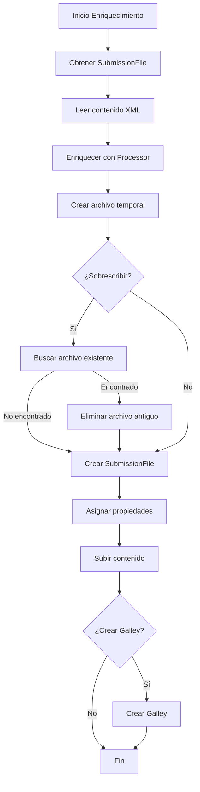
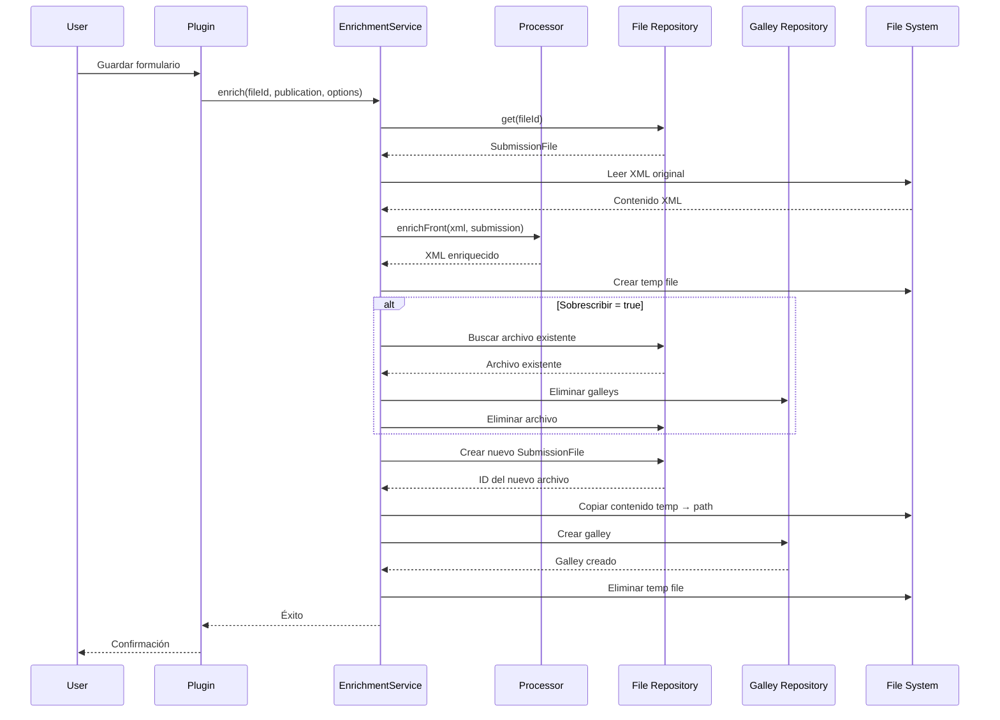

# Ticket 4: Gestión de Archivos y Galleys

## Descripción

Este ticket documenta el sistema de gestión de archivos del plugin: cómo se crean, almacenan y gestionan los archivos XML enriquecidos, y cómo se integran con el sistema de galleys de OJS para publicación.

## Responsabilidad Principal

**Clase**: [`EnrichmentService`](file:///home/santi/sedici/ojs-docker/data/public_ojs/plugins/generic/pluginTemplate/classes/services/EnrichmentService.php)

El servicio centraliza toda la lógica de gestión de archivos, desde la lectura del XML original hasta la creación de galleys publicables.

## Arquitectura del Sistema de Archivos



## Componentes del Sistema

### 1. Obtención de Archivos XML

#### Método: `getProductionXmlFiles($submissionId)`

**Propósito**: Listar todos los archivos XML disponibles para enriquecimiento.

**Criterios de selección**:
- **File stage**: `SUBMISSION_FILE_PRODUCTION_READY` (ID: 10)
- **Genre**: Archivos de tipo XML production
- **Extension**: Filtrado adicional por `.xml`

**Implementación**:
```php
public static function getProductionXmlFiles($submissionId)
{
    $collector = Repo::submissionFile()
        ->getCollector()
        ->filterBySubmissionIds([$submissionId])
        ->filterByFileStages([SUBMISSION_FILE_PRODUCTION_READY]);
    
    $files = $collector->getMany();
    $xmlFiles = [];
    
    foreach ($files as $file) {
        $genre = Repo::genre()->get($file->getData('genreId'));
        
        // Solo archivos de producción XML
        if ($genre && 
            $genre->getCategory() == Genre::GENRE_CATEGORY_DOCUMENT &&
            $genre->getDependent() == false) {
            
            $filename = $file->getLocalizedData('name');
            if (pathinfo($filename, PATHINFO_EXTENSION) === 'xml') {
                $xmlFiles[] = $file;
            }
        }
    }
    
    return $xmlFiles;
}
```

**Ejemplo de archivos detectados**:
- ✅ `article-12345.xml` (production document)
- ✅ `manuscript-v2.xml` (production document)
- ❌ `supplement.pdf` (no es XML)
- ❌ `stylesheet.xsl` (dependiente, no es artículo)

---

### 2. Proceso de Enriquecimiento

#### Método: `enrich($fileId, $publication, $options)`

**Parámetros**:
- `$fileId`: ID del archivo a enriquecer (o array de IDs para multilingüe)
- `$publication`: Objeto `Publication` con metadatos
- `$options`: Array con configuración
  - `suffix`: Sufijo para archivo resultante (default: `-enriched`)
  - `overwrite`: Si sobrescribir archivos existentes (default: `false`)
  - `createGalley`: Si crear galley automáticamente (default: `true`)

**Flujo**:
```php
public static function enrich($fileId, $publication, array $options = [])
{
    $suffix = $options['suffix'] ?? '-enriched';
    $overwrite = $options['overwrite'] ?? false;
    $createGalley = $options['createGalley'] ?? true;
    
    // Soporte multilingüe
    if (is_array($fileId)) {
        foreach ($fileId as $locale => $id) {
            self::enrichSingleFile($id, $publication, $suffix, $overwrite, $createGalley);
        }
    } else {
        self::enrichSingleFile($fileId, $publication, $suffix, $overwrite, $createGalley);
    }
}
```

---

#### Método: `enrichSingleFile($fileId, $publication, $suffix, $overwrite, $createGalley)`

**Responsabilidad**: Procesar un único archivo XML.

**Pasos detallados**:

```php
public static function enrichSingleFile($fileId, $publication, $suffix, $overwrite, $createGalley = true)
{
    // 1. Obtener archivo original
    $sourceFile = Repo::submissionFile()->get($fileId);
    if (!$sourceFile) {
        throw new Exception("Archivo no encontrado: {$fileId}");
    }
    
    // 2. Leer contenido del archivo
    $filePath = self::getFilePath($sourceFile);
    $xmlContent = file_get_contents($filePath);
    
    // 3. Enriquecer XML
    $submission = Repo::submission()->get($sourceFile->getData('submissionId'));
    $context = /* obtener contexto */;
    
    $enrichedXml = PluginMetadataProcessor::enrichFront(
        $xmlContent, 
        $submission, 
        $publication, 
        $context
    );
    
    // 4. Guardar en archivo temporal
    $tempFilePath = tempnam(sys_get_temp_dir(), 'enriched_xml_');
    file_put_contents($tempFilePath, $enrichedXml);
    
    // 5. Generar nombre del archivo enriquecido
    $originalName = $sourceFile->getLocalizedData('name');
    $pathInfo = pathinfo($originalName);
    $enrichedName = $pathInfo['filename'] . $suffix . '.' . $pathInfo['extension'];
    
    // 6. Manejo de sobrescritura
    if ($overwrite) {
        $existingFile = self::findExistingEnrichedFile(
            $submission->getId(), 
            $enrichedName, 
            $sourceFile->getData('locale')
        );
        
        if ($existingFile) {
            // Eliminar galleys asociados primero
            self::deleteGalleys($existingFile->getId());
            // Eliminar archivo
            Repo::submissionFile()->delete($existingFile);
        }
    }
    
    // 7. Crear nuevo archivo
    $newFile = self::createEnrichedFile(
        $submission->getId(),
        $publication,
        $sourceFile,
        $enrichedName,
        $sourceFile->getData('locale'),
        $tempFilePath,
        SUBMISSION_FILE_PRODUCTION_READY,
        $publication->getData('datePublished') ? 
            Application::get()->getRequest()->getUser()->getId() : null,
        time(),
        'EnrichmentService'
    );
    
    // 8. Crear galley si se solicitó
    if ($createGalley) {
        self::createGalley($newFile->getId(), $publication, $suffix);
    }
    
    // 9. Limpiar archivo temporal
    unlink($tempFilePath);
}
```

---

### 3. Creación de Archivos

#### Método: `createEnrichedFile(...)`

**Propósito**: Crear un nuevo `SubmissionFile` en el repositorio de OJS.

**Parámetros completos**:
```php
createEnrichedFile(
    int $submissionId,
    Publication $publication,
    SubmissionFile $sourceFile,
    string $filename,
    string $locale,
    string $tempFilePath,
    int $fileStage,
    ?int $uploaderUserId,
    int $timestamp,
    string $logLabel
): SubmissionFile
```

**Implementación**:
```php
private static function createEnrichedFile(/* ... */)
{
    // 1. Crear objeto SubmissionFile
    $newFile = Repo::submissionFile()->newDataObject();
    
    // 2. Establecer propiedades básicas
    $newFile->setData('submissionId', $submissionId);
    $newFile->setData('fileStage', $fileStage);
    $newFile->setData('uploaderUserId', $uploaderUserId);
    $newFile->setData('createdAt', date('Y-m-d H:i:s', $timestamp));
    $newFile->setData('updatedAt', date('Y-m-d H:i:s', $timestamp));
    
    // 3. Copiar propiedades del archivo original
    $newFile->setData('genreId', $sourceFile->getData('genreId'));
    $newFile->setData('locale', $locale);
    
    // 4. Asignar nombre localizado
    $newFile->setData('name', $filename, $locale);
    
    // 5. Asociar a la publicación (clave para galleys)
    $newFile->setData('assocType', Application::ASSOC_TYPE_PUBLICATION);
    $newFile->setData('assocId', $publication->getId());
    
    // 6. Crear en base de datos (sin archivo físico aún)
    $newFileId = Repo::submissionFile()->add($newFile);
    $newFile = Repo::submissionFile()->get($newFileId);
    
    // 7. Subir contenido del archivo temporal
    $fileManager = new FileManager();
    Repo::submissionFile()->edit(
        $newFile,
        ['uploadName' => $filename]
    );
    
    // Copiar contenido físico
    copy(
        $tempFilePath,
        Services::get('file')->get($newFile->getData('path'))
    );
    
    return $newFile;
}
```

**Propiedades clave**:
- `submissionId`: Vincula el archivo al submission
- `fileStage`: Define la etapa (production, review, etc.)
- `genreId`: Tipo de archivo (artículo, suplemento, etc.)
- `assocType` + `assocId`: Asociación con Publication (necesario para galleys)
- `locale`: Idioma del archivo
- `name`: Nombre del archivo (localizado)

---

### 4. Sistema de Galleys

#### Método: `createGalley($submissionFileId, $publication, $suffix)`

**Propósito**: Crear un galley publicable asociado al archivo enriquecido.

**¿Qué es un Galley?**
Un galley es la representación publicable de un archivo en OJS. Es lo que los lectores ven y pueden descargar.

**Proceso**:
```php
public static function createGalley($submissionFileId, $publication, $suffix)
{
    $file = Repo::submissionFile()->get($submissionFileId);
    
    // 1. Determinar label del galley
    $galleyLabel = 'XML';
    if ($suffix && $suffix !== '-enriched') {
        $galleyLabel .= ' ' . trim($suffix, '-');
    }
    
    // 2. Crear objeto Galley
    $galley = Repo::galley()->newDataObject();
    $galley->setData('publicationId', $publication->getId());
    $galley->setData('label', $galleyLabel);
    $galley->setData('locale', $file->getData('locale'));
    $galley->setData('submissionFileId', $submissionFileId);
    
    // 3. Insertar en base de datos
    $galleyId = Repo::galley()->add($galley);
    
    return Repo::galley()->get($galleyId);
}
```

**Ejemplo de galleys generados**:

| Sufijo | Label del Galley | Archivo |
|--------|------------------|---------|
| `-enriched` | `XML` | `article-enriched.xml` |
| `-completo` | `XML completo` | `article-completo.xml` |
| `-final` | `XML final` | `article-final.xml` |

**Visualización en frontend**:
Los galleys aparecen en la página del artículo como enlaces de descarga:
- 📄 XML
- 📄 PDF
- 📄 HTML

---

### 5. Limpieza y Gestión de Dependencias

#### Método: `deleteGalleys($submissionFileId)`

**Propósito**: Eliminar todos los galleys asociados a un archivo antes de eliminarlo.

**¿Por qué es necesario?**
Los galleys tienen foreign keys a `submission_files`. Si se elimina un archivo sin borrar sus galleys primero, se producen errores de integridad referencial.

**Proceso**:
```php
public static function deleteGalleys($submissionFileId)
{
    // 1. Obtener archivo para saber la publication
    $file = Repo::submissionFile()->get($submissionFileId);
    if (!$file) return;
    
    $publicationId = $file->getData('assocId');
    if (!$publicationId) return;
    
    // 2. Obtener galleys de la publicación
    $galleys = Repo::galley()
        ->getCollector()
        ->filterByPublicationIds([$publicationId])
        ->getMany();
    
    // 3. Filtrar galleys que usan este archivo
    foreach ($galleys as $galley) {
        if ($galley->getData('submissionFileId') == $submissionFileId) {
            Repo::galley()->delete($galley);
        }
    }
}
```

#### Hook: `SubmissionFile::delete::before`

**Método**: [`PluginTemplatePlugin::handleFileDelete`](file:///home/santi/sedici/ojs-docker/data/public_ojs/plugins/generic/pluginTemplate/PluginTemplatePlugin.php#L405-L427)

**Propósito**: Interceptar eliminaciones de archivos para limpiar galleys automáticamente.

**Implementación**:
```php
public function handleFileDelete($hookName, $args)
{
    $submissionFile = $args[0];
    
    // Solo procesar archivos de producción XML
    if ($submissionFile->getData('fileStage') == SUBMISSION_FILE_PRODUCTION_READY) {
        $filename = $submissionFile->getLocalizedData('name');
        
        // Detectar si es archivo enriquecido
        if (strpos($filename, '-enriched.xml') !== false ||
            strpos($filename, '-completo.xml') !== false) {
            
            EnrichmentService::deleteGalleys($submissionFile->getId());
        }
    }
}
```

**Ventaja**: Los usuarios pueden eliminar archivos sin preocuparse por limpiar galleys manualmente.

---

### 6. Gestión de Rutas Físicas

#### Método: `getFilePath($file)`

**Propósito**: Obtener la ruta física completa del archivo en el sistema de archivos.

**Desafío**: OJS 3.4 usa rutas relativas en la base de datos. El plugin necesita construir la ruta absoluta.

**Implementación**:
```php
public static function getFilePath($file)
{
    // Obtener directorio base de archivos
    $filesDir = Config::getVar('files', 'files_dir');
    
    // Obtener ruta relativa del archivo
    $path = $file->getData('path');
    
    if (!$path) {
        throw new Exception("El archivo no tiene ruta física asignada");
    }
    
    // Construir ruta absoluta
    $fullPath = $filesDir . '/' . $path;
    
    if (!file_exists($fullPath)) {
        throw new Exception("Archivo no encontrado: {$fullPath}");
    }
    
    return $fullPath;
}
```

**Ejemplo de ruta**:
- `files_dir` (config): `/var/www/ojs/files`
- `path` (DB): `journals/1/articles/123/submission/production/456-789-1-PB.xml`
- **Resultado**: `/var/www/ojs/files/journals/1/articles/123/submission/production/456-789-1-PB.xml`

#### Limitaciones

**Problema**: Este enfoque asume almacenamiento local. No funciona con:
- S3 / Object Storage
- Almacenamiento remoto
- Sistemas de archivos distribuidos

**Mejora futura**: Usar `FileService` de OJS para abstraer el almacenamiento:
```php
// Futuro (más robusto)
$stream = Services::get('file')->getFileStream($file->getData('path'));
```

---

### 7. Detección de Archivos Existentes

#### Método: `findExistingEnrichedFile($submissionId, $filename, $locale)`

**Propósito**: Buscar si ya existe un archivo enriquecido con el mismo nombre.

**Uso**: Para implementar la funcionalidad de sobrescritura.

**Implementación**:
```php
private static function findExistingEnrichedFile($submissionId, $filename, $locale)
{
    $collector = Repo::submissionFile()
        ->getCollector()
        ->filterBySubmissionIds([$submissionId])
        ->filterByFileStages([SUBMISSION_FILE_PRODUCTION_READY]);
    
    $files = $collector->getMany();
    
    foreach ($files as $file) {
        $existingName = $file->getLocalizedData('name', $locale);
        
        if ($existingName === $filename) {
            return $file;
        }
    }
    
    return null;
}
```

**Criterios de coincidencia**:
- Mismo `submissionId`
- Mismo file stage (production)
- Mismo nombre localizado
- Mismo locale

---

## Flujo Completo de Gestión de Archivos



---

## Estructura de Archivos en OJS

### Jerarquía de directorios

```
files/
└── journals/
    └── 1/                           # Journal ID
        └── articles/
            └── 123/                 # Submission ID
                ├── submission/
                │   └── original/
                │       └── article.xml
                └── production/
                    ├── article.xml           # Original
                    └── article-enriched.xml  # Enriquecido
```

### Tabla: submission_files

| Campo | Ejemplo | Descripción |
|-------|---------|-------------|
| `submission_file_id` | 456 | ID único |
| `submission_id` | 123 | Referencia al artículo |
| `file_stage` | 10 | PRODUCTION_READY |
| `genre_id` | 1 | Tipo de documento |
| `locale` | es_ES | Idioma |
| `file_id` | 789 | Referencia a `files` |
| `assoc_type` | 515 | PUBLICATION |
| `assoc_id` | 200 | Publication ID |

### Tabla: publication_galleys

| Campo | Ejemplo | Descripción |
|-------|---------|-------------|
| `galley_id` | 50 | ID único |
| `publication_id` | 200 | Referencia a publicación |
| `label` | XML | Etiqueta visible |
| `submission_file_id` | 456 | Archivo asociado |
| `locale` | es_ES | Idioma |

---

## Manejo de Errores

### Archivo no encontrado
```php
if (!$sourceFile) {
    throw new Exception("Archivo con ID {$fileId} no encontrado");
}
```

### Ruta física inexistente
```php
if (!file_exists($fullPath)) {
    throw new Exception("Archivo físico no existe: {$fullPath}");
}
```

### Error al parsear XML
```php
try {
    $enrichedXml = PluginMetadataProcessor::enrichFront(...);
} catch (Exception $e) {
    error_log('[EnrichmentService] Error enriqueciendo XML: ' . $e->getMessage());
    throw $e;
}
```

### Permisos de escritura
```php
$tempFilePath = tempnam(sys_get_temp_dir(), 'enriched_xml_');
if (!$tempFilePath || !is_writable($tempFilePath)) {
    throw new Exception("No se puede crear archivo temporal");
}
```

---

## Mejoras Propuestas

### 1. Abstracción de Storage
**Problema**: Dependencia de rutas físicas locales.
**Solución**: Migrar a `FileService` para soportar almacenamiento en nube.

### 2. Transacciones
**Problema**: Si falla la creación del galley, el archivo queda huérfano.
**Solución**: Implementar transacciones o rollback manual.

### 3. Versionado
**Problema**: No se mantiene historial de versiones enriquecidas.
**Solución**: Implementar sistema de versiones con timestamps.

### 4. Validación de XML
**Problema**: No se valida que el XML enriquecido sea válido JATS.
**Solución**: Validar contra DTD antes de guardar.

### 5. Procesamiento asíncrono
**Problema**: Enriquecimiento bloquea la interfaz de usuario.
**Solución**: Usar jobs queue para procesamiento en background.

### 6. Batch processing
**Problema**: Solo se puede enriquecer un archivo a la vez.
**Solución**: Permitir selección múltiple y procesamiento en lote.

---

## Referencias

- [OJS File Management](https://docs.pkp.sfu.ca/dev/documentation/en/architecture-files)
- [OJS Galley System](https://docs.pkp.sfu.ca/dev/documentation/en/architecture-entities#galley)
- [PHP tempnam()](https://www.php.net/manual/en/function.tempnam.php)
